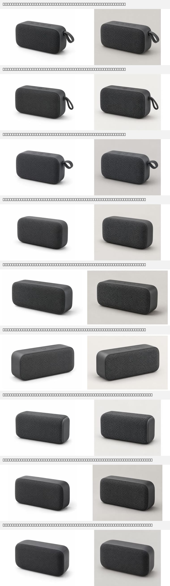

# 生产图片模型对比与故障恢复验收（2026-09-13）

## 结论

生产默认选择 `gpt-image-2.5-sunburst`，质量固定为 `high`。它在本轮相同提示词、相同 10 并发和相同生产链路下，生成速度最快、改图长尾最短，视觉上保持了干净稳定的商品形态。`gpt-image-2` 的材质和按键细节最好，可作为对质量更敏感、可接受等待的人工选项。`gpt-image-2.5-flare` 本轮改图完成率和长尾都不足，不进入公司默认路径。

本轮只比较用户指定的三个模型：`gpt-image-2`、`gpt-image-2.5-flare`、`gpt-image-2.5-sunburst`。基础 `gpt-image-2.5` 没有进入配置、调用或报告。

三个严格轮次都标记为 `failed`，因为验收门槛要求 10 次生成和 10 次改图全部形成可下载、可解码且模型/质量一致的产物。推荐 Sunburst 是三者之间的工程取舍，不代表它已经达到全成功上线门槛。

## 环境与范围

- 主机：`server244`。
- 图片对比应用镜像提交：`f7b66c726d927f86aa412106dd9b6b88eebb91a9`；清理与 Public MCP 自恢复修复后的最终生产镜像提交为 `44d15d90a6fa9e39c8b18453eb21af590aab3acb`。
- Codex 上游：`90854393966b21e9ebfd21b122334eb09a20c93d`，补丁版本 `shueho.2`。
- 代理模型：`gpt-5.6-luna`，`low` effort。
- 图片质量：三个模型统一为 `high`。
- 每个模型：10 个独立用户/thread 并发生成，再以各自真实产物并发改图，共 20 个逻辑 Turn。
- 链路：server244 Compose backend 内的生产 Web Edge → BFF → Gateway → Codex App Server → Provider。
- 公网 DNS 在验收期间返回 NXDOMAIN，所以链路标记为 `server244_internal_bff`，不包含 Cloudflare DNS/TLS。

同一生成提示词要求深灰色便携蓝牙音箱、45 度影棚视角、织物网面、纯白背景、柔和阴影、无文字和商标。改图仅允许把背景变为浅暖灰并增加自然投影，其他形态保持不变。

## 三模型结果

| 模型 | 生成产物 | 改图产物 | 生成首图 P95 | 生成总耗时 P95 | 改图首图 P95 | 改图总耗时 P95 |
| --- | ---: | ---: | ---: | ---: | ---: | ---: |
| `gpt-image-2` | 10/10 | 9/10 | 40.992 s | 54.316 s | 56.066 s | 216.063 s |
| `gpt-image-2.5-flare` | 10/10 | 5/10 | 38.289 s | 217.808 s | 42.987 s | 224.483 s |
| `gpt-image-2.5-sunburst` | 10/10 | 8/10 | 35.124 s | 42.784 s | 63.840 s | 70.236 s |

所有 30 个生成 Turn 都以 Harness `completed` 结束，并得到唯一、可下载、Sharp 完整解码、模型和 `high` 质量一致的图片。改图阶段：

- GPT Image 2：9 个产物；另 1 个 Turn 为 Harness `failed`。
- Flare：5 个产物；另有 2 个 `failed`、3 个 `completed` 但无图片。
- Sunburst：8 个产物；另 2 个 Turn 为 `completed` 但无图片。

没有未知终态或自动重提。所有提交 HTTP 状态均为 200，三个轮次均无 SSE 错误。

## 视觉检查

联系表每个模型取三个成功样本，左侧为生成、右侧为改图。自上而下依次是 GPT Image 2、Flare、Sunburst。

- GPT Image 2 的织物纹理、顶部按钮和小结构最丰富，成功样本的背景修改自然；部分挂绳和视角会轻微变化。
- Flare 的成功样本外观合格，产品轮廓较简洁，但本轮只有一半改图形成产物，且生成与改图都有超过 217 秒的长尾。
- Sunburst 的轮廓一致、画面干净，背景和投影修改明确；细节丰富度略低于 GPT Image 2，但速度与一致性最适合公司默认路径。

## 实际 usage 证据

Usage ledger 记录的是 Luna 代理编排响应，不包含图片 Provider 的独立图片计价，不能据此推算图片费用。

| 图片轮次 | 根 thread | usage 事件 | 已报告事件 | 已报告 token |
| --- | ---: | ---: | ---: | ---: |
| GPT Image 2 | 10 | 39 | 39 | 753,819 |
| Flare | 10 | 36 | 36 | 684,337 |
| Sunburst | 10 | 41 | 41 | 794,133 |

三个模型各有 10 个根 thread 命中 usage ledger，没有缺失 usage 状态。图片 Provider 的真实调用由 30 张生成产物、22 张正式改图产物、Harness Turn 和 Provider 模型字段共同证明。

## 生产读取负载

100 个 Better Auth 合成身份和原生 Harness thread 在 server244 上执行了 20、30、100 用户三档，每档 60 秒。四类读取和 SSE 同时运行。

| 用户 | 请求 | RPS | P95 | 错误率 | SSE ready |
| --- | ---: | ---: | ---: | ---: | ---: |
| 20 | 1,148 | 19.12 | 73.9 ms | 49.48% | 20/20 |
| 30 | 1,759 | 29.28 | 60.0 ms | 50.43% | 30/30 |
| 100 | 5,734 | 95.38 | 116.5 ms | 42.01% | 100/100 |

这些读取轮次严格失败。线程列表、图片会话和全部 SSE 正常；失败集中在状态/画布读取。根因是只执行 `thread/start`、从未提交用户 Turn 的空 thread 在 Gateway 重启后没有 Harness rollout，BFF ownership 仍存在。它不影响已经有 Turn 的历史，但意味着“新建后未发送消息”的任务不能跨 Gateway 重启保持可读。公司开放前应取消这种提前创建空 Harness thread 的产品流程，或给空任务建立应用层草稿身份，直到首次发送时再创建 Harness thread。

## 故障恢复与生产修复

本轮在生产发现并修复：

- Provider 图片模型与 `low/medium/high/xhigh/max/auto` 质量由应用配置进入原生 Harness 图片扩展；浏览器不能覆盖。
- Web BFF 图片清单补回模型质量字段。
- 生成图和上传图片在租户、线程、请求及产物所有权验证后，以有界内存 `image` 输入交给 App Server；浏览器事件移除路径和 data URL。
- 删除 thread 时同步删除 Harness 原生 `generated_images/<threadId>` 目录，并拒绝符号链接或非目录目标。
- Warehouse 在本地 Qwen 模型不可用时保持进程运行、标记 503、后台重试；模型相关操作继续失败关闭，存量证据 RPC 可读。
- Public MCP 健康检查重新验证完整 Warehouse 工具契约，可从启动竞态中自动恢复。

Gateway 停止并重建后 3.838 秒恢复到 `managedMcp=ready`。随后通过生产 BFF 读回 30 个正式根 thread、60 个原生 Turn、30 张生成图和 22 张改图，历史、模型和质量全部一致。

生产清理结果：测试会话 0、活跃测试成员 0、活跃测试工作区 0、测试 thread 0、活动 lease 0、待处理删除任务 0、测试图片元数据/lineage/原生 thread 目录 0。136 条 usage 审计记录因计费外键保留；对应 100 个合成 audit principal 已无会话和成员资格，测试工作区已归档。

## 尚未通过的门槛

- `commerce.shueho.com` 与 `mcp-commerce.shueho.com` 在公网 DNS 中不存在。Cloudflare 控制台没有可用登录态，本轮无法创建 Tunnel DNS 路由，因此没有公网 TLS 验收。
- server244 的 Qwen3 Embedding/Reranker 反向隧道没有监听，Warehouse 正确保持降级 503；Public MCP 的存量证据和队列健康为 200，依赖本地模型的检索/质量操作仍不可用。
- 三个图片模型都未达到 10/10 改图产物门槛。Sunburst 可作为当前默认，但应在 Provider 修复“completed 无图片”后复测。
- 本轮每个图片模型只有一个商品类别、10 并发和一次轮次，没有完成多小时 soak、跨提示词类别和更高并发测试。

原始生产收据、图片和测试 cookie 没有提交。可提交的脱敏数据见 [JSON 结果](2026-09-13-image-model-comparison.json)。
